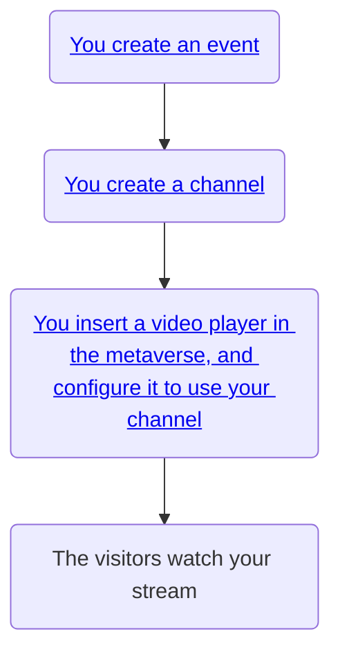
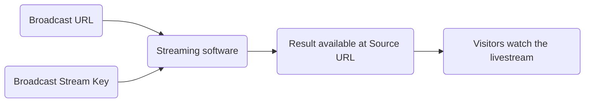

# How channels work

The same way it works for a TV, channels allow you to [stream content to a screen](/docs/metaverse/manage-your-metaverse/customize-your-metaverse/types-of-models/videos-and-screens). Within the metaverse, here is how channels are used :

 

Mext uses the RTMP (Real-Time Messaging Protocol) protocol for streaming audio, video, and data over the internet. RTMP is widely supported by [various streaming platforms and software](/docs/metaverse/manage-your-events/metaverse-tv/how-channels-work#streaming-software), and you are free to use any of those for your specific purpose.

Each channel is created with a **source URL**, and **broadcast URL** and a **broadcast stream key**.

- The **broadcast URL** is the _rtmp://_ link that you will insert into your streaming software. It is the receiving end of your stream.
- The **broadcast stream key** is a type of passphrase that is used to secure your stream. You will also need to insert it into your streaming software.
- The **source URL** is the _https://_ webpage where users can visualize your stream. It can be accessed directly inside your browser or included into an [Iframe](https://developer.mozilla.org/en-US/docs/Web/HTML/Element/iframe)

## Streaming software

Here is a list of services and software that can stream video or screensharing to an RTMP URL:

- [OBS Studio](https://obsproject.com/kb/) free : A
  popular and free open-source software for video recording and live streaming. It
  supports RTMP streaming to various platforms.
- [FFmpeg](http://trac.ffmpeg.org/wiki/StreamingGuide) free : A versatile command-line tool that can encode, decode, and stream audio and video. It supports RTMP streaming.
- [Twitch Studio](https://www.twitch.tv/broadcast/studio) free : Twitch's official streaming software that supports RTMP streaming to the Twitch platform.
- [Restream.io](https://restream.io/) free: A cloud-based multistreaming service that supports RTMP streaming to multiple platforms simultaneously.
- [Streamlabs OBS](https://streamlabs.com/) free: A user-friendly streaming software with built-in integration for popular platforms, including RTMP streaming support.
- [XSplit Broadcaster](https://www.xsplit.com/broadcaster) paid : A professional streaming and recording software that supports RTMP streaming.
- [Adobe Media Encoder](https://www.adobe.com/products/media-encoder.html) paid : A powerful media encoding software that can encode and stream content to RTMP servers.
- [Wirecast](https://www.telestream.net/wirecast/) paid : A live video streaming production tool that supports RTMP streaming to multiple platforms.
- [vMix](https://www.vmix.com/) paid : A live production software that allows you to mix and stream video to RTMP servers.
- [Wowza Streaming Engine](https://www.wowza.com/streaming-engine) paid: A robust media server software that supports RTMP streaming and can be used for building custom streaming applications.
